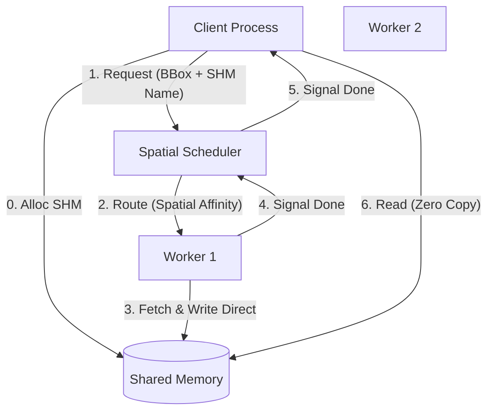

# Decoupled CloudVolume: High-Performance Shared Memory Architecture

这是一个基于 **ZeroMQ** 和 **Python Multiprocessing Shared Memory** 的高性能 3D 体素数据存取系统。

该项目将 `CloudVolume` 的 IO 操作从客户端解耦，转移到后台工作进程池中。通过**空间局部性调度算法**和**共享内存零拷贝技术**，显著提高了高并发场景下的数据读取效率，并实现了计算与 IO 的分离。

## 核心特性 (Key Features)

* **零拷贝通信 (Zero-Copy Data Transfer)**: 利用 `multiprocessing.shared_memory`，数据由 Worker 直接写入内存，Client 直接读取，避免了进程间通信（IPC）中巨大的序列化（Pickle）和拷贝开销。
* **空间感知调度 (Spatial-Aware Scheduling)**: `SpatialScheduler` 维护每个 Worker 的历史访问记录，优先将请求路由到已缓存了相邻数据的 Worker，最大化利用 LRU Cache。
* **RAII 内存管理**: 实现了 `AutoReleaseArray`，利用 Python 的引用计数机制，当数组对象被回收时自动 unlink 共享内存，防止资源泄漏。
* **直接渲染缓冲 (Direct Render Buffer)**: Worker 端通过劫持 `cv.renderbuffer`，让 CloudVolume 解压后的数据直接落在共享内存中，进一步减少了一次内存拷贝。

## 依赖安装 (Installation)

**重要**：本项目依赖定制化的 `LightWeightCloudVolume`，该版本针对 `partial_decompress` 进行了并行化优化，需从指定分支安装。

```bash
# 安装定制版 CloudVolume (partial_decompress_parallel 分支)
pip install git+https://github.com/P11011/cloud-volume.git@partial_decompress_parallel

# 安装其他依赖
pip install zmq msgpack numpy

```

## 架构设计 (Architecture)



## 项目结构

* `ProcessManager.py`: **启动入口**。负责启动调度器进程和 Worker 进程池，并进行健康监控。
* `SpatialScheduler.py`: **调度核心**。基于 ZMQ Router 接收请求，利用 BBox 重叠度或 Morton Code 进行智能路由。
* `VolumeWorker.py`: **工作单元**。持有 CloudVolume 实例，处理实际的数据下载和解压任务。
* `ClientProxy.py`: **客户端库**。封装了共享内存申请、协议打包和自动回收逻辑，对外提供类似 numpy 的切片接口。
* `main.py`: **使用示例**。演示如何使用 ClientProxy 进行数据请求。

## 使用方法 (Usage)

本系统采用 C/S 架构，需要先启动后台服务，再运行客户端。

编译包：
```bash
g++ -O3 -mavx2 -fopenmp -fPIC -shared fast_fill.cpp -o libfastfill.so
```

### 步骤 1: 启动后台资源调度与进程池

打开一个终端窗口（Terminal A），开启大页，运行 `ProcessManager.py`。这会启动一个调度器和配置数量的 Worker 进程。

```bash
# Terminal A
mount -o remount,huge=always /dev/shm
python ProcessManager.py

```

*输出示例：*

```text
=== Starting CloudVolume Cluster ===
[Scheduler] Listening on tcp://127.0.0.1:5555
[worker_0] Connected. Sending READY.
[worker_1] Connected. Sending READY.
=== Cluster Ready: 1 Scheduler + 4 Workers ===

```

### 步骤 2: 运行客户端进行请求

打开另一个终端窗口（Terminal B），运行客户端脚本。你可以同时开启多个客户端进程。

```bash
# Terminal B
numactl --interleave=all python main.py

```

*代码示例 (`main.py`):*

```python
from ClientProxy import ClientProxy

# 初始化 Proxy，连接到本地 Scheduler
# 注意：这里传入 cv 对象主要是为了获取元数据（如 dtype, num_channels）
client = ClientProxy("tcp://127.0.0.1:5555", cv)

# 像操作普通 numpy 数组一样操作 client
# 这一步会自动触发：申请共享内存 -> 调度 -> 后台下载 -> 填充内存 -> 返回
data = client[1000:1100, 2000:2100, 50:55]

print(f"Data shape: {data.shape}")
# data 变量超出作用域后，共享内存会自动释放

```

## 配置说明

* **Worker 数量**: 在 `ProcessManager.py` 中通过 `manager = ProcessManager(worker_num=4)` 修改。
* **缓存策略**: 在 `VolumeWorker.py` 中修改 `CloudVolume` 的初始化参数（如 `lru_bytes`）来控制每个 Worker 的内存占用。
* **调度策略**: `SpatialScheduler.py` 目前默认优先使用 BBox 体积重叠算法（Cache Affinity），兜底策略使用 Z-Order (Morton Code) 哈希。

## 注意事项

1. **Shared Memory 泄漏**: 虽然实现了 RAII 自动回收，但如果 Client 进程被 `kill -9` 强杀，可能导致 `/dev/shm/` 下残留文件。建议定期检查或重启机器。
2. **端口占用**: 默认使用 `5555` 端口，请确保该端口未被占用。
3. **环境依赖**: 必须确保已正确安装上述定制版 `cloud-volume`。